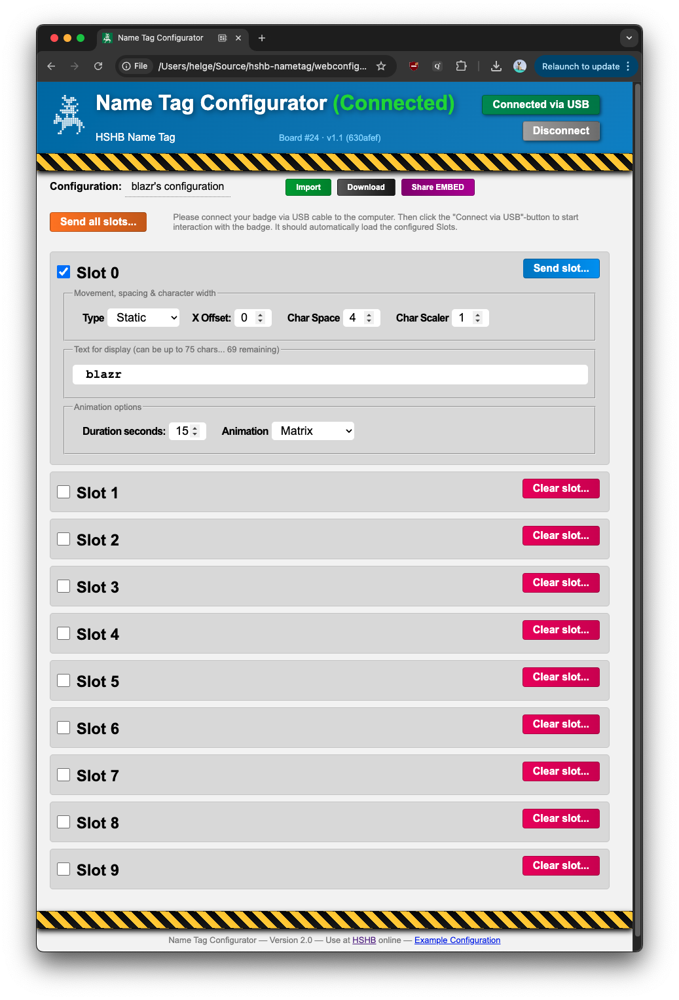

# HSHB Nametag

This repositoy contains the source code for the HSHB Nametag, a PCB designed in the [Hackerspace Bremen e.V.](https://www.hackerspace-bremen.de). See also [project description here](https://wiki.hackerspace-bremen.de/mittelantraege/antraege/finanziert/2023/projekt_hshb_led_namensschild).


## Prerequisites

Building and flashing is done with [PlatformIO](https://platformio.org/).

You can get the latest binaries for all boards in the current [GitHub releases](https://github.com/HackerspaceBremen/hshb-nametag/releases).

## Building

Open the project folder in a PlatformIO IDE (VS Codium, etc.) and build it. During development, adjusting the `BOARD_ID` directly in `get_build_flags.py` might be easiest. If you're using the `pio` binary simply run

```shell
$ BOARD_ID=1 pio run
```

Replace `BOARD_ID=1` with the number of your board (sticker on the back), which is used to select the proper battery calibration values. If you do not provide the `BOARD_ID` variable, the code will compile with the calibration data of board 1 by default.

If `git` is available in your `$PATH`, the binaries will include a build version like `vX.Y.Z-N-shorthash` in their identification string.

## Flashing

Flash the project by using the appropriate button in your PlatformIO IDE. If you're using the `pio` binary run

```shell
$ pio run -t upload
```

## Serial console

A serial console can be opened by running

```shell
$ pio device monitor
```

## Flashing Tool

To update the firmware of your tag you need to either follow above description to create and upload your own build, or if you got handed a `firmware.hex` file for your **board-id** you could install this on your own.

Check out the [README](flashdirect/) in the `flashdirect` folder.

## Web configurator

You can use the [WebConfigurator](https://hackerspacebremen.github.io/hshb-nametag/) locally on your computer to configure your tag. Just connect it to USB and open the webpage in a browser that supports USB-Serial connections.


